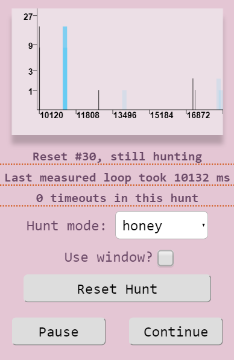
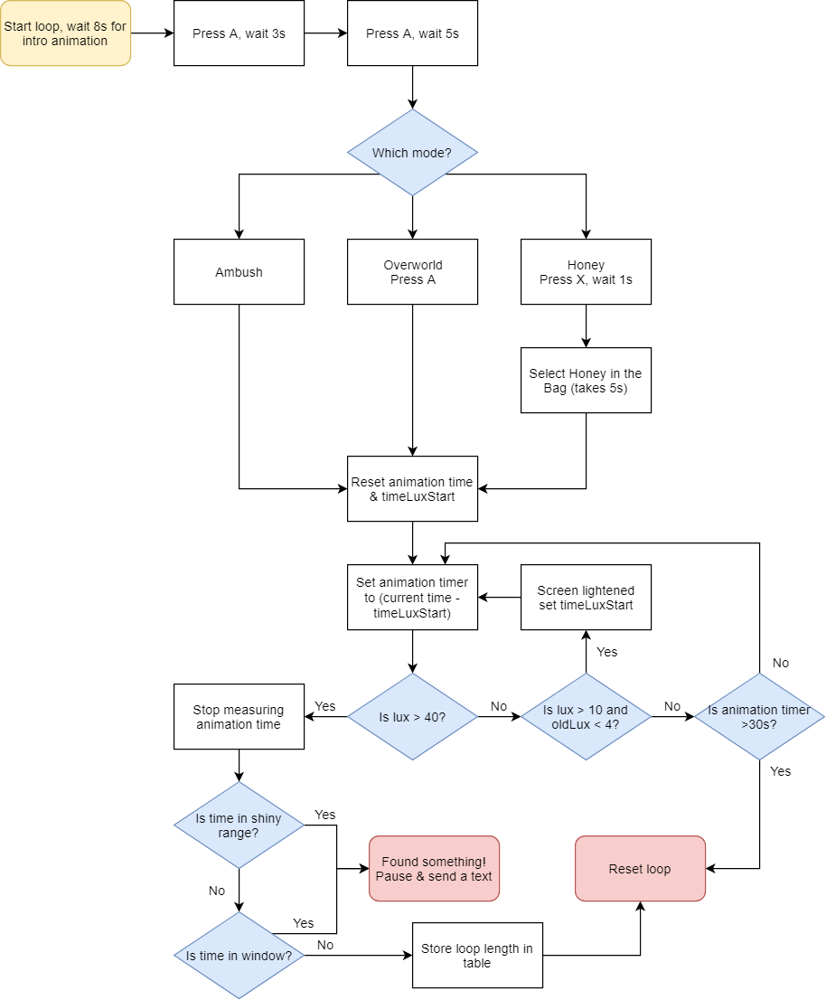

# Shiny Machine✨

The Shiny Machine is an ESP32-powered device that hunts shiny pokemon in Pokemon Ultra Sun & Ultra Moon (USUM).

## Background

Shiny pokemon are significantly rarer versions of pokemon, with alternate color schemes and a unique intro animation when sent into battle. In the latest pokemon games, the base odds of encountering a shiny pokemon is 1/4096. By collecting  the Shiny Charm item in-game, players can increase their odds to 3/4096.

Players that hunt for shiny pokemon often set up their avatars in-game to re-trigger certain pokemon encounters every time they turn off and on their 3DS; this is called "soft resetting." For most pokemon encounters, soft resetting re-rolls the chance of a shiny pokemon being generated, so shiny hunters frequently soft reset their game hundreds to thousands of times by hand in order to find the shiny variant of their target pokemon.

I started this project to automate soft resetting for shiny pokemon. I found a few examples of people building shiny hunting machines that were exceedingly helpful when prototyping:

- [/u/cabubaloo's shiny legendary auto hunter for the Nintendo Switch](https://old.reddit.com/r/ShinyPokemon/comments/aauks9/lgpe_shiny_legendary_auto_hunter_i_have_gotten/)
- [Nooby's Gamepro](https://www.noobysgamepro.com/)
- [/u/CaptainSpaceCat's shiny hunting device](https://www.reddit.com/r/pokemon/comments/7g6zbl/automatic_shiny_hunting_device/)
- [dekuNukem's Poke-O-Matic](https://www.youtube.com/watch?v=jyJPsZc-QTM)

Most importantly for this project was [this post by /u/Inigmatix](https://old.reddit.com/r/ShinyPokemon/comments/8igm15/talkobservation_from_making_a_shiny_resetting/). They explain that shiny pokemon have a battle intro animation in Pokemon Sun and Moon that lasts exactly 1.18 seconds. As a pokemon encounter begins, the lower screen of the 3DS transitions from dark to bright. The time it takes for the screen to light up depends on the length of the encountered pokemon's battle intro animation. By measuring the time between these screen transitions, the presence of a shiny pokemon can be inferred. I happened to have the parts used by Inigmatix when I discovered their post, so my first iteration of the machine was a very similar Arduino-based device, down to the pile of books holding servos in place over the A and Start buttons. It wasn't long, however, that I started to come up with improvements.

## Design

### Microcontroller

The heart of the Shiny Machine is a WEMOS LOLIN32 ESP32 board with a built in OLED screen. ESP32 microcontrollers can be programmed using the Arduino IDE, so it was easy to port my Arduino code to it. I wanted to use an ESP32 instead of an Arduino for the MCU was because ESP32s have built-in wifi.

When I ran my first few hunts with an Arduino as the MCU, the machine notified me that it found a shiny pokemon by pausing its operation and blinking an LED. Because the button-pushing servos were noisy, I moved the machine to my garage. However, this meant that I started compulsively stopping by the garage to see if the machine had found anything yet. By switching to the ESP32, I could have the machine display its status on a webpage on my home network. But then I started compulsively checking the webpage, so I ended up setting up a Twilio account and had the machine call their API. Now, I get a text from Twilio when the machine finds a shiny pokemon, so I don't have to think about it at all.

### Motors and sensors

I wanted the Shiny Machine to interact with my 2DS in a non-invasive way so that I could still use the handheld regularly on its own. This meant that the machine would need to interact with the screen and buttons in a way similar to a human player. I hooked up a luminosity sensor to watch the bottom screen, and buttons were pressed by rotating servo arms.

The SG-50 servos were functional but somewhat noisy and bulky, so I switched to solenoids driven by Darlington transistors. I started with [these 5V solenoids](https://www.adafruit.com/product/2776) from Adafruit, but found that I had to significantly over-volt(?) them to get the force necessary to press the buttons on the 2DS. In order to avoid burning my house down, I switched to [12V solenoids](https://www.adafruit.com/product/412). I'm powering them at 20V, which should be within tolerance.

The luminosity sensor I started the project with was a [TSL2561](https://www.sparkfun.com/products/retired/12055). It died during a demonstration, so I upgraded to an [APDS9301](https://www.sparkfun.com/products/14350). This had the interesting side effect of significantly improving my timing measurements; the TSL2561 often had a spread of about 50ms around the values I measured. With the APDS9301, mesurements were accurate within 10ms.

Here's an old graph with the original luminosity sensor:

And here's with the new sensor (admittedly, this screenshot has less samples):

### Enclosure

(enclosure picture)

I'm a big duct-tape-and-bailing-wire kind of guy, so the enclosure is made from an old IKEA shelf and a bunch of hot glued cardboard. Maybe one day I will upgrade it to a laser-cut wood enclosure, but for now this will suffice. The plywood base is on adhesive felt pads in order to cut down on sound from the solenoids as they tap the buttons. There's also a rubber backstop that sits just behind the 2DS to keep it from sliding out of the enclosure.

### 2DS setup

(2DS pic)

I tape down the shoulder buttons of my 2DS so that the MAchine can soft reset just by pressing the Start button. Initially I used rubber bands, but they kept sliding off the 2DS. I'm open to any ideas on ways to be less wasteful of tape. For overworld and some ambush encounters, the player needs to walk into contact with a sprite - I just wedge a dime under the circle pad.

### Software

I programmed the Shiny Machine using the Arduino IDE. I don't have a lot of experience with C++, so the code is nothing to write home about. You'll need to add a file called *arduino_secrets.h* with a number of define statements that provide wifi information and Twilio configuration. *example_secrets.h* is a template for you to use when setting up the defines.

Every encounter animation is measured, and the length is stored in a table. If the measured timespan is 1.18 seconds longer than a known measurement, the machine pauses and sends a notification. Initially I was measuring animation durations by hand and reprogramming the machine, but when I realized that the machine could infer shinies using an offset from its stored timings, I was able to reduce the amount of configuration for each hunt and also support more types of encounters.

Responsibilities for data and user interaction are divided between the ESP32 and a webpage frontend that communicates with the ESP32. The ESP32 serves up JSON with timing table data and information on the machine's state and setting. By POSTing form data to the ESP32, the web frontend configures the machine's settings. The address of the ESP32 needs to be set in app.js in the variable *rootURL*.

The frontend is also responsible for generating graphs of the encounter timings. Each timing contributes to a vertical black line on the graph that is followed to its right by a blue rectangle. The black line represents a timing, and the blue rectangle is the offset for that timing to be for a shiny pokemon. The x-axis of the graph is animation length in milliseconds, and the y-axis shows occurrences of timings logarithmically. That way you can get a good feel for how the pokemon are distributed, and identify outliers and hardware failures. For instance, I've found that if one of the shoulder buttons is becoming untaped, a drift of values in the graph can be a good indicator that something is wrong.

## Encounter modes

The Shiny Machine supports 3 types of encounters: ambush, overworld, and honey.

### Ambush

Ambush encounters were the first supported encounter because I initially wanted to capture a wormhole legendary, [Kyogre](https://twitter.com/Hypothete/status/1134536299090604032). After repeating the process with the remaining wormhole legendaries, I moved on to using this mode with [repeatable ambushes](https://bulbapedia.bulbagarden.net/wiki/Ambush_encounter#Introduced_in_Sun_and_Moon) you can find in Alola. Outside of legendaries, there's maybe 35 or so possible species to encounter in repeatable ambush encounters.

### Overworld

Overworld encounters basically just involve pressing A to interact with an overworld sprite of a pokemon. This mode is mostly useful for ultra beasts, although you could use it for a few others like Zygarde in Resolution Cave.

### Honey

I showed the Shiny Machine to a few friends, and they pointed out that I was not leveraging techniques like Sweet Scent pre-gen 7 and the item Honey to initiate wild encounters. I redesigned the hardware so that the machine could access the player inventory, and built out honey mode. Currently for this mode to work the Bag menu item needs to be in the upper right of the inital menu screen, and honey should be placed at the top of the Items section. Adding honey mode drastically expanded the number of species that the Shiny Machine could hunt.

## Window controls

This is an advanced feature I added for burgeoning pokemon researchers. By defining a window for timing, the machine will continue to operate normally, but it will also pause if any measured animation falls within the defined window of time. This allows you to do things like associate timings with certain pokemon, shiny hunt a smaller set of pokemon in the encounter, or hunt for pokemon with abilities that affect the intro animation length.

## Observations

Here's a list of factors that affect the length of the battle intro animation:

- Species of your party lead
- Species of encountered pokemon
- Abilities of each of the above (each ability adds ~4s delay)
- Whether either pokemon is shiny (1.18s delay each)
- Friendship level of your party lead (>2s, I don't have a good measurement of this number)

Amazingly, even with this much variation in timing, there are rarely false positives in the hunts. Particular locations and species combos can cause the occasional false positive, like if one species in an area causes a weather effect and another has an ability called into effect at the start of the encounter. I want to collect more data and flesh this out.

Also, if I leave the machine running all day and night, it seems to spot 3 shiny pokemon every 2 days. This is right on odds with the Shiny Charm.

## Thanks

- All of the inventors mentioned in the Background section
- Paul2 & Alan, for their insight on honey
- John Romkey for [this post](https://romkey.com/2018/07/30/stop-the-loop-insanity/) on Arduino loops
- The very friendly people at [Dorkbot PDX](https://dorkbotpdx.org/) for helping with hardware design and troubleshooting
- My wife, for tolerating the constant clicking noises coming from our garage

If this repo helps you build your own Shiny Machine or if you have any questions about the project, please [drop me a line](mailto:duncan@hypothete.com)!
